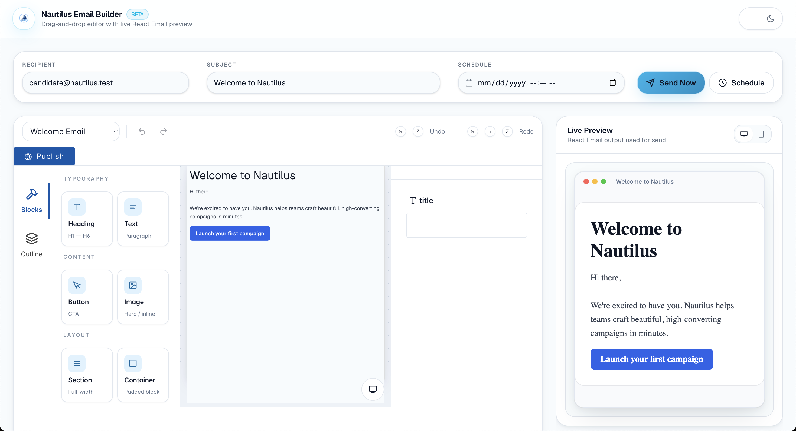
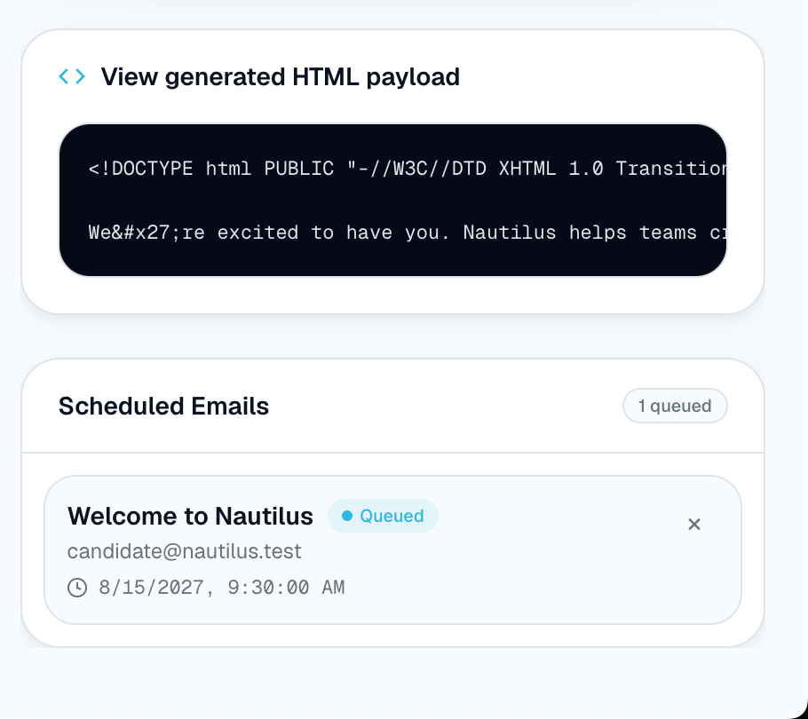
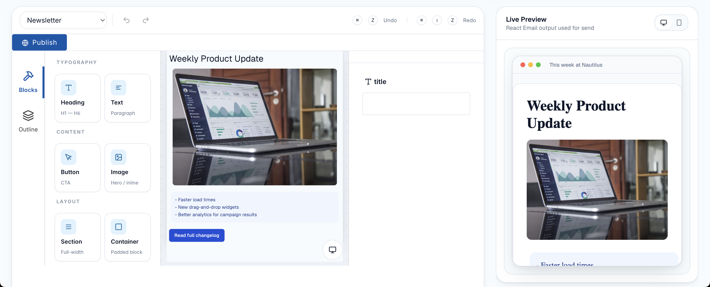
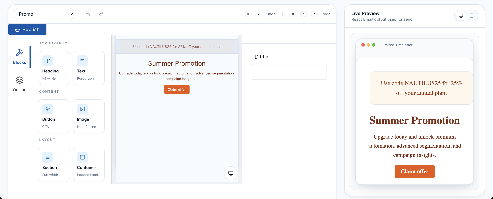

# Nautilus Email Builder

A visual email authoring workflow that keeps editor state, live preview, immediate send, and scheduled delivery aligned through one shared render pipeline.

## 1-minute walkthrough

<div align="center">
  <a href="https://www.loom.com/share/4ef1c4e8e5e040c9a4629eda00e47d18">
    
  </a>
</div>

<p align="center">
  <a href="https://www.loom.com/share/4ef1c4e8e5e040c9a4629eda00e47d18">
  </a>
</p>

## Live demo

https://email-builder-eight-delta.vercel.app

## Architecture doc

See [docs/ARCHITECTURE.md](./docs/ARCHITECTURE.md) for system design, render pipeline, send/schedule flows, and production evolution notes.

## Preview



---

## What it does

Nautilus is a single-page **visual email authoring workflow** built on Next.js. Users compose structured marketing emails, preview rendered output in real time, send immediately through Resend, or queue delivery for a future time.

The product surface is intentionally narrow and workflow-oriented:

- Author emails from structured Puck editor state — not ad hoc HTML.
- Switch starter templates (Welcome, Newsletter, Promo) without breaking render fidelity.
- Preview the same React Email HTML that Send Now and scheduled execution will use.
- Send through Resend when credentials are configured; otherwise receive an explicit mock success response.
- Schedule, list, and cancel queued sends through a small REST API.
- Execute due scheduled emails through an explicit `run-due` endpoint.

---

## Why I built it

Email tooling looks simple from the outside and breaks quickly in production. The hard part is not dragging blocks — it is keeping **one source of truth** across preview, delivery, and deferred execution while external services and deployment constraints behave unpredictably.

I built Nautilus to demonstrate product engineering fundamentals that show up in real messaging systems:

- **Shared render pipeline** — one block schema feeds preview, send, and schedule execution.
- **Workflow architecture** — clear boundaries between authoring UI, API layer, delivery adapter, and scheduler adapter.
- **API design** — small, explicit endpoints with predictable success and failure shapes.
- **Scheduler boundaries** — persistence and execution separated behind a `SchedulerAdapter` interface.
- **Resend integration** — real delivery when configured, with demo-safe behavior when it is not.
- **Graceful fallback behavior** — corrupt store recovery, partial batch success, and mock send paths that do not crash the demo.
- **Serverless tradeoffs** — honest constraints around ephemeral storage, external cron, and what would change in production.

This project is optimized for reviewers who want to see how I think about systems, not just UI polish.

---

## Screenshots

### Editor overview

The main workflow combines recipient and subject inputs, schedule controls, block editing, and a live React Email preview on one page.


### Scheduler panel

The scheduler panel lists queued emails and surfaces the lightweight scheduling model used in the demo.



### Newsletter template

The newsletter template demonstrates image blocks, text sections, buttons, and preview fidelity against the shared render pipeline.



### Promo template

The promo template demonstrates template switching and consistent rendering between the editor canvas and the React Email preview.



---

## Architecture

Nautilus is organized around one serialized representation: **Puck editor state** (`EmailBuilderData`).

```text
Puck editor state (EmailBuilderData)
        │
        ├── Canvas renderer (Puck block render fns — authoring UX)
        │
        └── Shared render pipeline (email-render.tsx)
                    │
                    ▼
            React Email → HTML
                    │
        ┌───────────┼───────────┐
        ▼           ▼           ▼
   Live preview  Send Now   Scheduled execution
   (iframe)      (Resend)   (run-due → Resend)
```

The scheduler sits behind a storage adapter. In this demo, that adapter persists to a JSON file — locally under `.data/` and on Vercel under `/tmp`. Execution is triggered explicitly via `POST /api/schedule/run-due`, not by a background worker inside the app.

For deeper coverage, see [docs/ARCHITECTURE.md](./docs/ARCHITECTURE.md).

---

## Technical decisions

| Decision | Rationale |
|---|---|
| Puck for authoring | Structured block schema with field types maps cleanly to a typed render pipeline and API payloads. |
| React Email for output | Industry-standard email HTML generation; same renderer for preview, send, and scheduled execution. |
| `SchedulerAdapter` interface | Swaps persistence/execution backends without changing API routes or UI contracts. |
| JSON file store in demo | Keeps the scheduling story runnable without infra; makes serverless limits visible and discussable. |
| Explicit `run-due` endpoint | Separates "queue a send" from "execute due sends" — mirrors cron/worker boundaries in production. |
| Mock send when Resend is absent | Demo and CI stay functional; API response includes `mock: true` so behavior is never ambiguous. |
| Temporal packages declared, not wired | Documents the intended production direction without pretending the demo runs a worker fleet. |

---

## Features

- Visual block authoring (Heading, Text, Button, Image, Section, Container)
- Starter templates with one-click switch and editor remount
- Desktop (600px) and mobile (390px) editor viewports
- Live HTML preview rendered through the shared pipeline
- Send Now via Resend with graceful mock fallback
- Schedule future sends, list queue, cancel by ID
- Execute due sends via `POST /api/schedule/run-due`
- Light/dark chrome with Puck canvas forced to light for accurate email preview

---

## Project structure

```text
src/
├── app/
│   ├── api/
│   │   ├── send/route.ts              # POST immediate send
│   │   └── schedule/
│   │       ├── route.ts               # GET list, POST schedule
│   │       ├── [id]/route.ts          # DELETE cancel
│   │       └── run-due/route.ts       # POST execute due sends
│   ├── page.tsx                       # Single-page authoring workflow
│   └── layout.tsx
├── components/builder/chrome.tsx      # Navbar, compose fields, theme toggle
└── lib/
    ├── puck-config.tsx                # Block schema and canvas renderers
    ├── puck-data.ts                   # Block ID normalization
    ├── email-render.tsx               # Shared React Email render pipeline
    ├── email-send.ts                  # Resend integration + mock fallback
    ├── scheduler.ts                   # SchedulerAdapter + JSON file store
    ├── scheduler-executor.ts          # runDueScheduledEmails()
    ├── scheduler-types.ts
    └── templates.ts                   # Starter templates
docs/
├── ARCHITECTURE.md
└── PROJECT_IMPROVEMENTS.md
screenshots/
├── editor-overview.png
├── scheduler-panel.png
├── newsletter-template.png
└── promo-template.png
```

---

## API

All routes return JSON. No authentication in the demo — treat as a portfolio artifact, not a production endpoint surface.

### `POST /api/send`

Send the current email immediately.

**Request**

```json
{
  "to": "user@example.com",
  "subject": "Welcome to Nautilus",
  "data": { "content": [/* EmailBlock[] */] }
}
```

**Success (200)**

```json
{
  "success": true,
  "message": "Email sent successfully.",
  "mock": false,
  "to": "user@example.com",
  "subject": "Welcome to Nautilus",
  "id": "resend-message-id"
}
```

When `RESEND_API_KEY` is unset, `mock: true` and delivery is simulated.

---

### `GET /api/schedule`

List all scheduled emails, sorted by `scheduledAt`.

**Success (200)**

```json
{
  "success": true,
  "items": [/* ScheduledEmail[] */]
}
```

---

### `POST /api/schedule`

Queue an email for future delivery.

**Request**

```json
{
  "to": "user@example.com",
  "subject": "This week at Nautilus",
  "data": { "content": [/* EmailBlock[] */] },
  "scheduledAt": "2026-06-21T15:00:00.000Z"
}
```

`scheduledAt` must be a valid ISO timestamp strictly in the future.

**Success (200)**

```json
{
  "success": true,
  "item": { /* ScheduledEmail */ }
}
```

---

### `DELETE /api/schedule/:id`

Cancel a scheduled email (soft cancel — status becomes `"cancelled"`).

**Success (200)**

```json
{
  "success": true,
  "item": { /* ScheduledEmail with status: "cancelled" */ }
}
```

---

### `POST /api/schedule/run-due`

Execute all due scheduled emails (`status === "scheduled"` and `scheduledAt <= now`). Intended to be invoked by an external cron or operator.

**Success (200)**

```json
{
  "success": true,
  "processed": 2,
  "sent": [/* ScheduledEmail[] */],
  "failed": [{ "id": "...", "subject": "...", "message": "..." }],
  "message": "Processed 2 scheduled email(s)."
}
```

Partial success is supported: failures are collected in `failed` while successful sends continue.

---

## Quick start

```bash
git clone <repo-url>
cd nautilus-email-builder
npm install
cp .env.example .env.local   # optional — mock send works without Resend
npm run dev
```

Open [http://localhost:3000](http://localhost:3000).

---

## Environment variables

| Variable | Required | Default | Purpose |
|---|---|---|---|
| `RESEND_API_KEY` | No | — | Resend API key; omit for mock send mode |
| `RESEND_FROM_EMAIL` | No | `onboarding@resend.dev` | Sender address passed to Resend |
| `VERCEL` | Auto on Vercel | — | Selects `/tmp` vs `.data/` scheduler storage |

Copy `.env.example` to `.env.local` for local development. On Vercel, set variables in Project Settings → Environment Variables.

---

## Verification

**Without Resend configured**

1. Start the dev server and open the editor.
2. Enter a recipient and subject, edit blocks, and confirm the live preview updates.
3. Click Send Now — expect HTTP 200 with `mock: true` in the API response.
4. Schedule a future send — confirm it appears in the scheduler panel via `GET /api/schedule`.
5. Cancel a queued send — confirm status becomes `"cancelled"`.

**With Resend configured**

1. Add `RESEND_API_KEY` and a verified `RESEND_FROM_EMAIL` to `.env.local`.
2. Send Now — expect HTTP 200 with `mock: false` and a Resend message `id`.
3. Schedule a send for one minute ahead, then invoke:

```bash
curl -X POST http://localhost:3000/api/schedule/run-due
```

4. Confirm the item moves to `"sent"` and the recipient receives the email.

---

## Serverless scheduling tradeoffs

This demo runs on Vercel-shaped constraints. The scheduling model is intentional and limited:

| Constraint | Demo behavior | Production direction |
|---|---|---|
| Ephemeral filesystem | Scheduled emails stored in `/tmp` on Vercel | Durable store (Postgres, Redis, S3) behind `SchedulerAdapter` |
| No in-app cron | `run-due` must be called externally | Vercel Cron, Temporal schedule, or queue worker |
| Single-process execution | Sequential send loop, no distributed lock | Idempotent workers with lease/lock semantics |
| No auth on API | Public endpoints | API keys, session auth, or internal-only network |
| Mock sends count as success | Scheduled items marked `sent` in dev | Gate `markSent` on real delivery confirmation |

The `@temporalio/*` packages are included to signal the intended workflow-engine evolution — durable timers, retries, and observability — but no Temporal worker or workflow is implemented in this repository yet.

---

## Current limitations

- **Dual render paths** — Puck canvas uses browser HTML; preview/send use React Email. Styles are parallel, not shared modules.
- **Flat block model** — `content` is a flat array; no nested drop zones for child blocks.
- **No draft persistence** — editor state lives in React memory; only scheduled sends are persisted.
- **No automatic scheduler** — due emails do not send until `run-due` is invoked.
- **Ephemeral Vercel storage** — scheduled data in `/tmp` is lost on redeploy or cold start.
- **No API authentication** — all routes are publicly callable.
- **No server-side email validation** — recipient is checked for non-empty trim only.
- **No automated tests** — verification is manual.

See [docs/PROJECT_IMPROVEMENTS.md](./docs/PROJECT_IMPROVEMENTS.md) for a prioritized improvement backlog and interview-ready talking points.

---

## Future improvements

- Durable scheduler backend (Postgres or Redis) implementing `SchedulerAdapter`
- Temporal workflow for schedule → wait → send → retry
- Vercel Cron wiring for `run-due`
- Unified style tokens between Puck canvas and React Email renderers
- Draft autosave and template versioning
- API authentication and rate limiting
- Automated integration tests for send and schedule flows

---

## Tech stack

| Layer | Technology |
|---|---|
| Framework | Next.js 16 (App Router, Turbopack) |
| UI | React 19 |
| Visual editor | Puck (`@puckeditor/core`) |
| Email rendering | React Email + `@react-email/render` |
| Delivery | Resend |
| Scheduling (declared) | Temporal packages (not yet implemented) |
| Styling | Tailwind CSS v4 |
| Language | TypeScript |
| Deployment | Vercel |
